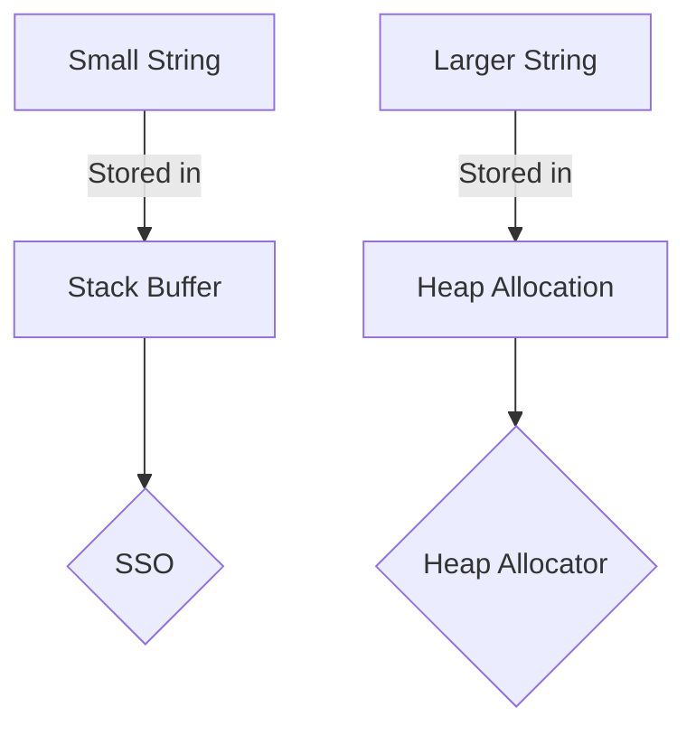

## Move Semantics

Move Semantics by Klaus Iglberger (CppCon 2019): [Link](https://www.youtube.com/watch?v=St0MNEU5b0o)

```cpp
std::vector<int> v1 {1, 2, 3, 4, 5};
// in stack we will just store the pointers (to the start and the end)
// the actual elements will be stored in heap
std::vector<int> v2 {};
v2 = v1;
// when we do v2 = v1, we copy the contents, that is new memory is assigned in
// heap and content of old vectors are copied

v2 = std::move(v1);
// in this case we are transferring the ownership. that is, now the pointer of
// v2 will point to the heap memory orignally pointed by v1.
// and pointers of v1 will be set to 0.
```

### L value vs R value

1. **L-Value (Left Value)**:
An **L-value** is an expression that **refers to a memory location** and 
can persist beyond a single expression. It typically appears on 
the **left-hand side** of an assignment, but it can also be used on the 
right-hand side.

- **L-values** have an identifiable location in memory, meaning you can take 
their address using the `&` operator.
- Examples of **L-values** include variables, dereferenced pointers, or array 
elements.
- **Modifiable L-values** are L-values that can be changed (i.e., non-const), 
while **non-modifiable L-values** are constants.

#### Examples of L-values:
```cpp
int x = 5;    // `x` is an L-value because it refers to a memory location
x = 10;       // `x` can appear on the left-hand side of an assignment

int* p = &x;  // You can take the address of an L-value
*p = 20;      // Dereferenced pointer `*p` is an L-value
```

In the code above:
- `x` is an L-value because it refers to a memory location that persists across 
expressions.
- `*p` is also an L-value because it refers to the value stored at the 
address in `p`.

2. **R-Value (Right Value)**:
An **R-value** is an expression that does **not have a persistent memory location**. 
It usually represents **temporary values** that only exist during the evaluation 
of an expression. R-values typically appear on the **right-hand side** of an 
assignment and are not addressable (you can't take the address of an R-value).

- R-values are usually **temporary objects**, **literals**, or **expressions** 
like `2 + 3`.
- You can't assign to an R-value because they do not refer to a memory location 
that can be modified.

#### Examples of R-values:
```cpp
int x = 5 + 10;  // `5 + 10` is an R-value (a temporary value)
int y = 42;      // `42` is an R-value (literal)

x = y + 1;       // `y + 1` is an R-value (result of the expression)
```

In the code above:
- `5 + 10` is an R-value because it's a temporary result and cannot be assigned to.
- `42` is a literal R-value.


#### L-value References:
- Traditional references (as introduced in earlier versions of C++) are **L-value references**.
- They can only bind to L-values.

Example:
```cpp
int x = 10;
int& ref = x;  // L-value reference to `x`
ref = 20;      // Modifies `x`
```

#### R-value References:
- **R-value references** (introduced in C++11) are used to bind to R-values, 
allowing you to modify them.
- They are denoted by `&&`.
- Commonly used in **move semantics** to avoid unnecessary copies.

Example:
```cpp
int&& rref = 5;  // R-value reference to the temporary value `5`
rref = 10;       // Modifies the R-value
```

Here, `rref` is an R-value reference that allows us to bind to a temporary 
object (`5`) and even modify it.

- **Move semantics** make use of R-value references to "move" resources from 
one object to another, avoiding expensive deep copies. This is especially useful
when dealing with temporary objects (R-values).
  
Example:
```cpp
std::string s1 = "Hello";
std::string s2 = std::move(s1);  // Moves the contents of `s1` to `s2`
// after ownership transfer s1 will now be a valid but undefined state!
```

In the code above:
- `std::move(s1)` is an R-value reference that allows the move constructor of 
`std::string` to transfer ownership of the data from `s1` to `s2`.
- <mark>`std::move` unconditionally casts its input into an rvalue reference. 
It doesnt move anything!
- <mark>`std::move(s)` when s is const, leads to copy not move!

```cpp
const std::string s1 = "Shivam Verma";
std::string s2 = std::move(s1);  // this is COPY not MOVE
std::cout << s1 << ' ' << s2 << '\n';
```


### Operators
1. Copy Assignment Operator

    `vector& operator=(const vector& rhs);` It takes an lvalue

2. Move Assignment Operator

    `vector& operator=(vector&& rhs);` It takes an rvalue

```cpp
class Widget {
    private:
        int i {0};
        std::string s{};
        int* pi {nullptr};
    
    public:
        // Move constructor: Goal is to transfer content of w into this
        // Leave w in a valid but undefined state
        Widget (Widget&& w) : i (w.i), 
                              s (std::move(w.s)), 
                              pi (w.pi) {
            w.pi = nullptr;

            // we could also do: i (std::move(w.i)), 
            //                   s (std::move(w.s)), 
            //                   pi (std::move(w.pi))

        }

        // Move assignment operator
        Widget& operator=(Widget&& w) {
            i = std::move(w.i);
            // s = w.s // don't do this, it copies not move
            s = std::move(w.s);
            delete pi; // need to clear exisiting resources first!
            pi = std::move(w.pi);

            w.pi = nullptr; // reset content of w

            return *this;
        }
}
```


### Small string optimisation


## Small String Optimization (SSO)



- For small strings (e.g., "short str"), the data is stored directly in the 
object on the stack.
- For larger strings, the data is dynamically allocated on the heap, and the 
object holds a pointer to that data.


## Universal References (Forwarding Reference)

```cpp
template<typename T>
void f(T&& x); // Forwarding Reference

auto&& var2 = var1; // Forwarding Reference
```
They represent: 
- an `lvalue` reference if they are initialised by an lvalue.
- an `rvalue` reference if they are initialised by an rvalue.

```cpp
template<typename T>
void foo(T&& ) {
    print("foo(T&&)");
}

int main () {
    Widget w{};
    foo(w); // prints "foo(T&&)" 
    foo(Wifget{}) // also prints "foo(T&&)"

    // w was lvalue, Widget{} was rvalue: T&& binded to both
}
```
- <mark>`std::forward` conditionally casts its input into an rvalue reference. 
It doesnt forward anything!

    - If given value is lvalue, cast to an lvalue reference.
    - If given value is rvalue, only then cast to an rvalue reference.

`rvalues` can bind to lvalue reference to const, but not to lvalue reference.
```cpp
void f(Widget& );           // 1
void f(const Widget& );     // 2
template<typename T>        // 3
void f(T&& );

int main() {
    f(getWidget{});             // this can bind to 3, 2 but not 1
}
```  

