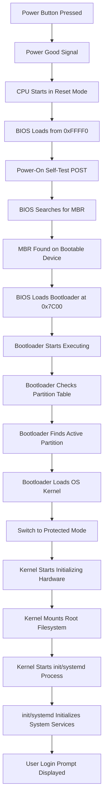

# Linux Boot Process

Booting is the process of loading an OS from disk and starting it.

## The OS Boot Process

1. **Hit the power button**

-   Triggers a `power good` signal.
    -   Electric pulse sent to reset pin of the CPU (Power On Reset).
    -   CPU is in `Reset` mode, i.e., it is not executing any instructions.
-   All devices get power and initialize themselves.
-   Every register is set to zero, except `Code Segment (CS)` and 
`Instruction Pointer (IP)`, which are set to `0xf000` and `0xfff0` respectively.
    -   Thus, the `physical address = (CS << 4) + IP = (0xf000 << 4) + 0xfff0 = 0xf0000 + 0xfff0 = 0xffff0` (We are operating in 16-bit mode right now).
        -   This physical address is the place where the CPU starts executing instructions.
-   The CPU is activated in Real Mode and it starts executing from `0xffff0` (or `ffff0h`), which is a memory location in the `BIOS chip` and not in the RAM.
    - The BIOS chip (Basic Input/Output System) is a small, `non-volatile` memory chip located on the motherboard of a computer.
    -   Real Mode
        -   Only 1 MB of RAM addressability in the range `0x0` to `0x100000`.
            -   This is because there are 20 physical address bus lines available. (2^20 = 1048576 = 1 MB)
        -   `16 bit addressing:` Available registers (Eg: `AX`) are of size 16 bits, so two registers are combined to give the physical address.
            -   Logical address (LBA) = segment:offset
            -   `Physical address = (segment << 4) + offset`
                -   The segments are segments/parts of the addressable 1 MB of RAM and the offsets are offsets into that segment.
                -   Eg: If the segment is `0xf000` and the offset is `0xfff0`, then the `physical address = (CS << 4) + IP = (0xf000 << 4) + 0xfff0 = 0xf0000 + 0xfff0 = 0xffff0`
2.  **Basic Input/Output System (BIOS) takes over.**
-   Placed in Flash/EPROM Non-Volatile Memory. Its job is load the bootloader.
-   In a multi-processor environment, one processor is a `Boot Processor (BSP)` which executes all instructions and the others are `Application Processors (APs)`.
-   Conducts a Power-On Self-Test (`POST`).
    -   Performs system inventory.
    -   Checks and registers all devices connected.
-   Finds `Master Boot Record (MBR)` in the first sector of a device (the hard disk, SSD, USB, etc.) that is usually 512 bytes in size, loads it into RAM at position `0x7c00`, jumps to that location and starts executing.
    -   MBR is a 512 byte sector that's logically split into three sections.
        -   The first 446 bytes is reserved for a program, which is usually a Bootloader. (Eg: [GRUB](https://www.gnu.org/software/grub))
        -   The next 64 bytes (16x4 bytes) are for a partition table with four partitions in it.
        -   The last two bytes are for the Boot Signature bytes `0x55` (or `55h`) and `0xAA`(or `AAh`) in order, that identify that a particular sector is the MBR.
            -   If this signature is not found in the first sector, then the next device is searched.
-   The BIOS loads the Bootloader into memory.
    -   This might be the first stage of the Bootloader, which loads the second stage of the Bootloader into memory, as 446 bytes are not sufficient to store all the complex logic required to load an OS.
    -   Bootloader might give an option to load a particular Operating System.
    -   Sets up the `GDT/IVT` for the Operating System.
    -   Switches from `Real Mode` to `Protected Mode`.
        -   Memory addressability goes from 1 MB to the entire range of available RAM.
3.   **The Bootloader starts executing and checking the partition table for an active/bootable partition table.**

-   On finding the bootable partition, the Bootloader loads the first sector of that partition (called the Boot Record) from the hard disk to the RAM.
4.   **The Boot Record loads the operating system into memory.**
5.   **Timers, devices, hard disks, etc. are initialized by the Operating System in the Kernel Space.**
6.   **In Linux, the `init` process is the first process in User Space that initializes the OS processes, daemons and displays login prompt.**

## Resources

-   [PC Booting: How PC Boots](https://www.youtube.com/watch?v=ZplB2v2eMas)
-   [Booting an Operating System](https://www.youtube.com/watch?v=7D4qiFIosWk)

